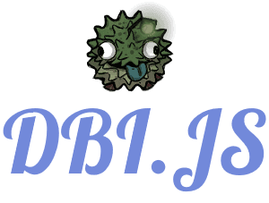

   
  

    
  

   
  

    
    
    
  

  

    
  

## Information
dbi.js is an API wrapper for [Discord Bot Index](https://discordbotindex.com) using [Node.JS](https://nodejs.org) to make it easier to use it's API.

## Installation
#### Requirements
- [Node.JS](https://nodejs.org) >= 8.0.0
- [Yarn](https://yarnpkg.com) (optional) better performance

Run `yarn add dbi.js` or `npm i dbi.js` to install.

## Examples
Examples can be found inside of the `/examples` directory